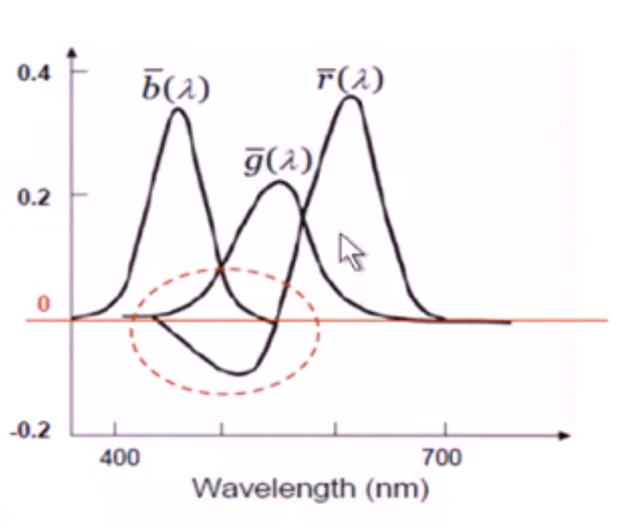
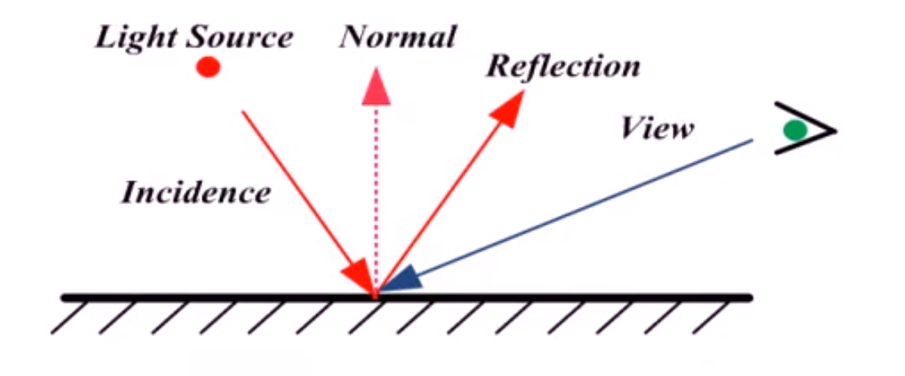
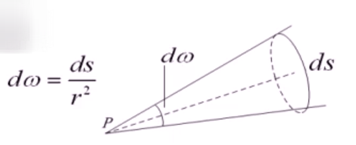
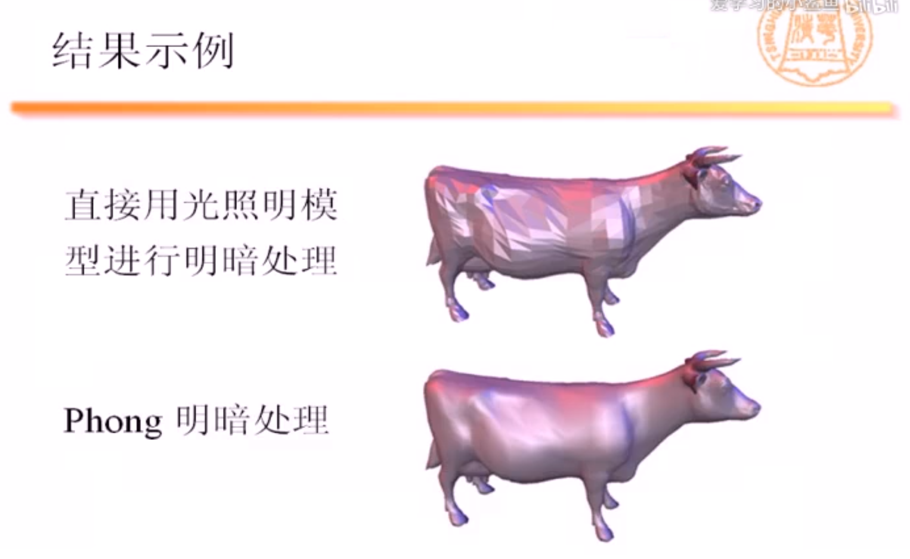
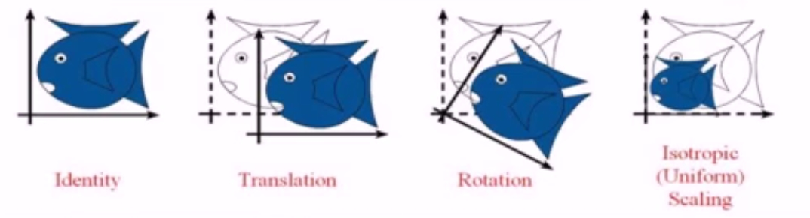
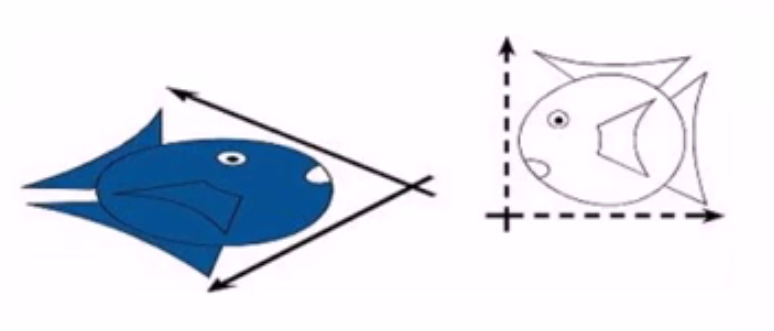

# 基本概念

## 色彩视觉

### 什么是色彩

色彩是对不同波长的光的能量的感知：

- 不同波长的电磁波（electromagnetic waves）对应不同的色彩；
- 对于人眼能感知的光，其波长范围为 380nm 到 760nm 之间

#### 光的谱分布

- 光是由不同波长的电磁波按照某种能量分布混合叠加而成
  - 例如：“白光”是由所有可见波长的电磁波以相等的强度混合得到。
- 谱分布： 光在各个可见波长的分量的强度分布函数称为光的谱分布

和光类似，色彩也可以使用谱分布函数来进行描述。
然而，使用谱分布函数来表示色彩，不仅复杂，而且这样的表示方法并不是一一对应关系。
实际上，不同的谱分布函数可能对应为同一种色彩，也就是异谱同色现象。

#### RGB 色彩空间

在所有用于表示色彩的各种色彩空间中，<font color="red">R</font><font color="green">G</font><font color="blue">B</font>色彩空间在计算机图形学中的使用最为广泛

- 色彩使用三通道 RGB 向量 (r,g,b)来表示；
- 在RGB色彩空间中，有部分的常用操作可以通过对RGB三通道分别处理二进行；
- 通常可以将r,g,b分别规整化为[0,1]内的浮点数；当使用 8bit 进行存储时，r,g,b通常取值为 [0,255] 内的整数。

色彩被表示为三个基本色彩： <font color="red">R</font><font color="green">G</font><font color="blue">B</font>的线性组合：

$$
C = rR + gG + bB
$$

*为什么选择红绿蓝作为基本色彩？*

- 以人类视觉的三刺激理论为基础
- 人眼的视网膜中有三种锥状视觉细胞，分别对红、绿、蓝三种光最敏感

**缺点：**

一部分色彩无法表示成 R,G,B 光波的正线性组合，这是RGB色彩空间的一个缺点。



#### 其它色彩空间

- CMY
- HSV
- CIE XYZ

##### CMY 色彩空间

- 不同于RGB的另外一种基本色彩

  1. Cyan(青),Magenta(品红),Yellow(黄): 分别是 R, G, B 的补色(complements).

    ```text
        C   1   R
        M = 1 - G
        Y   2   B
    ```

- CMY 被称为“减色系统”：
   1. RGB 为 “加色系统”——(0,0,0) 为黑，(1,1,1)为白
   2. CMY——(0,0,0) 为白， (1,1,1) 为黑

通常用于印刷

##### HSV 色彩空间

在真实的RGB彩色图像中，可以包含多达 `256 * 256 * 256` = <font color="red">16,777,216</font> 种。 使用 RGB 色彩空间来描述和定位如此大量的不同色彩非常困难。HSV 系统则提供了一个直观的方法来对色彩进行准确地选择，HSV 色彩空间主要应用于：图像处理、分形图像、艺术领域

HSV: 圆锥形的色彩空间

- Hue(色调)，也叫色相，它描述了色彩的本征属性，即我们常说的一个色彩是 红、橙、黄、绿、青、蓝、紫， 等等
- Saturation(饱和度)，也叫纯度，饱和度越低，色彩越白
- Value of brightness(亮度), 亮度越低，色彩越黑

HSV 比 RGB 更加用户友好。

##### CIE XYZ 色彩空间

由国际发光照明委员会于1931年提出。

CIE XYZ 色彩空间可以表示所有可感知的色彩（而RGB空间却不能）

- 色彩基 XYZ 是色彩基 RGB 的线性变换
- 更多地应用于色彩科学的研究
- 于人类的感知系统密切相关

CIE XYZ 色彩空间可以可视化为如下色度图， 其中 $x = X/(X + Y + Z)$, $y = Y / (X + Y + Z)$


## 图像和像素

图像可以看成是一个二位离散函数: $f(x,y)$,
函数 $f$ 的定义域是有矩阵排列着的许多各自组成，这些格子被称为*像素(pixel)*
函数 $f$ 的取值则为各个像素的色彩： 对于彩色图像，可以是 RGB 或者 RGBA; 对于灰度图像，$f$ 为单值函数。

## 三角网络模型（********）

- 从虚拟的三维场景及相机的位置信息中，生成出一副二维图像。
- 而三维产景又以怎样的数据解构来表示？
  - 简单的球体，长方体可直接用其参数描述；
  - 对于复杂模型，则需要使用*参数曲线和曲面*或者更一般的*网格模型来进行描述*。
  - 网格模型之中又以三角网格最为常用。

三角网格是由一系列欧式空间中的三维顶点以及连接这些顶点的若干三角面片组成，具体包括：
    - 顶点集合： $V=(v_{1},v_{2},...,v_{n})$
    - 面片集合： $F=(f_{1},f_{2},...f_{m})$
      - 其中，F 中每个面片 $f1$ 都是由 $V$ 中的顶点构成的空间三角形：
        $f_{1}=(v_{a1},v_{b1},v_{c1}), f_{2}=(v_{a2},v_{b2},v_{c2}),...$

### 三角面片的法向量

- 三角面片的法向量是垂直于该三角面片所在平面的非零向量；
- 对于每个三角面片单独而言，其法向量都有两种可能的朝向；
- 法向量的朝向决定了一个三角面片的正面与反面；
- 对于连续可定向的三角网络整体而言，相邻的三角面片需要具备一致的法向量朝向。

三角网格顶点的法向量可以通过其周围的所有三角面片的法向量通过加权叠加计算：

[三角网格顶点的法向量](./三角网格顶点的法向量.drawio ':include :type=code')

> 假设 v 是 k 个三角面片， $f_{1}$,$f_{2}$,...,$f_{k}$ 所共有的顶点；
>  
> 按算数平均计算：$$N_{v}=(N_{f1}+...+N_{fk})/k$$
>
> 按面积加权平均计算： $$N_{v}=(S_{f1}N_{f1}+...+S_{fk}N_{fk})/(S_{f1+...+S_{fk}})$$
>
> 按角度加权平均计算： $$N_{v}=(Ang_{f1}N_{f1}+...+Ang_{fk}N_{fk})/(Ang_{f1}+...+Ang_{fk})$$

### 三角网格的简单绘制

- 三角网格模型的每个顶点需要制定一个色彩属性
- 基于色彩的绘制
  - 模型表面的没电的色彩通过其所在三角面片的顶点色彩插值得到。
- 基于光照的绘制
  - 需要制定一个虚拟的光照环境
  - 如何计算光照对色彩的影响是最大的问题

## 光照模型与明暗处理

光照模型（lighting model 或 illumination model）用于计算光的强度。

- 局部光照明（Local Lighting）
    关注物体直接收到光源影响所产生的光照效果。

- 全局光照明 (Global Lighting)
    - 关注阴影效果；
    - 关注所有不是直接与光源位置相关的光照效果，例如反射和折射效果等。

### 光照模型历史

- 1967 年，Wylie 等人第一次在显示物体时加入了光照明效果，认为光的强度与物体到光源的距离成反比关系
- 1970 年， Bouknight 提出了第一个光反射模型：
  - Lambert 漫反射光 + 环境光
  - 发表于 Communication of ACM
- 1971 年，Gouraud 提出了漫反射模型加插值的思想：
  - Lambert 漫反射光 + Barycentric 插值
  - 发表于 IEEE transactions on Computers
- 1975 年，Phong 提出了图形学中第一个有影响也是最有影响的光照模型： Phong 模型
  - 漫反射(diffuse light) + 环境光(ambient light) + 高光(specular light)
  - 发表于 Communication of ACM

### 光的传播

#### 反射定律

- 入射角等于反射角
- 入社光线、反射光线、以及反射面的法向量位于同一平面内



#### 折射定律（也叫Snell定律）

- 入射角和反射角的正弦值之比是一个仅仅取决于介质的常数
- 这个常数称为相对折射系数


#### 能量守恒定律

光的传播遵循能量守恒定律：

$$I_{i}=I_{d} + I_{s} + I_{t} + I_{v}$$

- $I_{i}$: 入射光的能量
- $I_{d}$: 漫反射(diffuse reflection)光的能量
- $I_{s}$: 镜面反射(specular reflection)光的能量
- $I_{t}$: 折射反射(reflection)光的能量
- $I_{v}$: 被介质和物体所吸收的能量

### 光的度量方法

#### 立体角（Solid Angle）

衡量物体相对于某一视点 P 的视角大小：



立体角 = 空间面片的面积($dS$) / 面片到视点的距离平方($r^2$)

立体角最大为 $4π$

#### 光通量（Luminous Flux）

光通量定义为： 单位时间内通过面源 $dS$ 的光能量，记为 $dF$

#### 发光强度（Radiance）

发光强度定义为： 单位立体角内的光通量，记为 $I$。

### Phong模型

- Phong 模型支持点光源和方向光源。
- Phong 模型是局部光照模型，将局部光照明效果分解为三个部分：
  1. 漫反射
  2. 镜面反射
  3. 环境光效果

示意图：


其中：

- L 是入射光强度；
- R 是反射光强度；
- N 是物体表面的法向量；
- V 是视点方向；
- H 是 L 和 V 夹角的角平分线方向。

#### 漫反射光效果

- 漫反射光的传播是各向同性的
- 漫反射光的强度为（主要取决于入射光方向和法向的夹角）：$$I_{d}=I_{i}K_{d}*(L·N)$$
    - $I_{i}$ 是入射光强度
    - $L$ 是入射光方向
    - $N$ 是法向量
    - $K_{d}$ 是漫反射系数
    - $K_{d}$ 具有三个分量 $k_{dr}$,$k_{dg}$,$k_{db}$分别代表 R, G, B 三个通道的漫反射系数。
    - $K_{d}$ 与模型自身的色彩紧密相关。

#### 镜面反射光效果

- 对于光滑的平面，一句反射定律，反射光线问问集中在一个小的立体角内，这些反射光我们称之为镜面反射光。
- 镜面反射光的强度为：$$I_{s}=I_{i}K_{s}*(R·V)^n$$
    - $K_{s}$ 是镜面反射系数，与物体表面光滑程度相关；
    - $n$ 是反射指数， $n$ 越大，则高光区域越集中

#### 环境光效果

- 环境光的强度为： $I_{a}=I_{i}K_{a}$
  - $K_{a}$是物体对环境光的反射系数

视角方向的发光强度为漫反射光分量、镜面反射光分量，以及环境光分量的发光强度之和：$$ I=I_{i}K_{a} + I_{i}K_{s}*(R·V)^n + I_{i}K_{d}*(L·N)$$

### 明暗处理

考虑到物体表面的几何细节往往并不规则，为了减缓由模型离散化所导致的不光滑的色彩效果，通常的明暗处理除了使用光照模型外，还需要进行插值。

Gouraud 明暗处理和 Phong 明暗处理：

- Gouraud 明暗处理是对色彩进行插值
- Phong 明暗处理则是对法相进行插值

#### Gouraud 明暗处理

- 由 Gouraud 于 1971 年提出， 又被称为 Gouraud 插值
- 计算方法：
  - 首先计算所有模型顶点的色彩值
  - 对模型上的任何一点，按照其所在的三角面片上顶点的色彩值按重心插值（Barycentric Interpolation） 的结果赋予其色彩值。

#### Phong 明暗处理

- 由 Bui Tuong Phong 于 1973 年在他的博士论文中提出。（与Phong模型是不同的概念）
- 计算方法：
  - 与 Gouraud 明暗处理不同， Phong 明暗处理不是对色彩插值，而是对点的法向量进行插值，得到连续的法向量场，在利用该法向量场逐点使用光照模型进行色彩的计算。



## 视点变换和视点方向

图形学关注于如何将由几何模型组成的三维场景绘制成高质量的彩色图像。

变换在图形学中至关重要： 通过变换，可以简洁高效地设置和编辑三维场景，光照位置，以及视点方向。

### 为什么需要变换

假设我们已经有了一段可以绘制正方形 `[0,1]*[0,1]` 的代码。 如果现在我们需要绘制另外一个一条对角线是从 `(lox, loy)` 到 `(hix, hiy)` 的矩形， 我们应该怎么做？

1. 一种方法是写一段新的代码。对于矩形简单可以这么做， 但是对于复杂的例子（比如一个茶壶），怎么办呢？
2. 可以利用变换来解决问题，这样利用变换的解决方案再图形学中，随时都需要用到。 使用变换可以使代码更加快速、灵活、模块化。

### 什么叫变换(transformation)

- 变换是一个将空间中的点 $x$ 映射成其它点 $x'$ 的函数。
- 广泛应用于： Morphing, Deformation, Viewing, Projection, Real-time shadows...

Morphing 和 deformation 区分

> Morphing: 阿猫变形成阿狗的过程
>
> Deformation: 小老虎变大老虎，瘦老虎变壮老虎的过程

### 简单变换



- 从左到右的变换分别是：
  - 不变(Identity)、平移(Translation)、旋转(Rotation)、均衡缩放(Isotropic scaling)。
- 变换可以相互复合和嵌套
  - 例如：先旋转，再缩放，最后平移
- 简单变换都是可逆的

### 变换分类

### 常见的变换

都是由简单变换组合得来

- 刚体变换（Rigit-body Transformation）
  - 保持度量（长度、角度、大小）
  - 刚体变换包括：
    - 不变、平移、旋转、以及它们的复合
- 相似变换（Similarity Transformation）
  - 保持角度
  - 相似变换包括：
    - 不变、平移、旋转、均衡缩放、以及它们的复合
- 线性变换（Linear Transformation）
  - 线性变换满足如下方程：$$L(p + q) = L(p) + L(q)$$ $$aL(p) = L(ap)$$
  - 线性变换包括：
    - 不变、旋转、缩放（不一定要均衡缩放）
    - 对称（Reflection）, 错切（Shear）
    - 
- 仿射变换（Affine Transformation）
  - 保持直线以及直线与直线的平行
    - 两条在仿射变换之前平行的直线，在仿射变换之后依旧平行
  - 仿射变换包括：
    - 线性变换、相似变换、以及它们的复合
    - 
- 投影变换（Projective Transformation）
  - 保持直线

[投影变换-保持直线](./投影变换-保持直线.drawio ':include :type=code')

### 变换的表示

考虑简单的二维仿射变换：

1. $x' = ax + by + c$
2. $y' = dx + ey + f$

可以将(1),(2) 统一地写成矩阵形式：

$$
\begin{bmatrix}
x' \\ y'
\end{bmatrix} =
\begin{bmatrix}
a & b \\ d & e
\end{bmatrix}
\begin{bmatrix}
x \\ y
\end{bmatrix}
+
\begin{bmatrix}
c \\ f
\end{bmatrix}
$$

其中：

$$
M = \begin{bmatrix}
a & b\\d & e
\end{bmatrix}
$$

$$
t = \begin{bmatrix}
c \\ f
\end{bmatrix}
$$

$$
t = \begin{bmatrix}
x' \\ y'
\end{bmatrix}
$$

最终表示成：

$$
p' = Mp + t
$$

变换的表示涉及到了两个变量， `M` 和 `t`, 如果使用齐次坐标(Homogenous Coordinates) 来表示 $p$ 和 $p'$, 则上述公式成为：$$p' = Mp$$

#### 齐次坐标

齐次坐标的本质是使用四位数组来表示三维空间中的点和向量。

- Formulation in E^2
  $$
    \begin{bmatrix}
    x' \\ y'
    \end{bmatrix} =
    \begin{bmatrix}
    a & b \\ d & e
    \end{bmatrix}
    \begin{bmatrix}
    x \\ y
    \end{bmatrix}]
    \begin{bmatrix}
    c \\ f
    \end{bmatrix}

    \\ p' = Mp + t
  $$
- Homogeneous formulation
  $$
    \begin{bmatrix}
    x' \\ y' \\ 1
    \end{bmatrix} =
    \begin{bmatrix}
    a & b & c \\ d & e & f \\ 0 & 0 & 1
    \end{bmatrix}
    \begin{bmatrix}
    x \\ y \\ 1
    \end{bmatrix}

    \\ p' = Mp
  $$

由于引入了新的维度，我们使用 4*4 的作用矩阵，同时使用 (x, y, z, w) 来表示一个点或向量：
$$
\begin{bmatrix}
x' \\ y' \\z' \\ w
\end{bmatrix} =
\begin{bmatrix}
a & b & c & d \\ e & f & g & h \\ i & j & k & l \\ m & n & o & p
\end{bmatrix}
\begin{bmatrix}
x \\ y \\ z \\ w
\end{bmatrix}

\\ p' = Mp
$$

大部分情况下 ，$w = 1$， 可以忽略。 当起始坐标被仿射矩阵作用时， $w$ 不会改变, 而投影矩阵作用时，$w$会改变。

#### 齐次坐标的几何意义

- 当 $w$ 非零时，通过将所有四个坐标同时除以 w 以归一化
  - 例如 (2x, 2y, 2z, 2) 等价于 (x, y, z, 1)
- 当 $w$ 为零时，齐次坐标(x, y,z, 0) 可以理解为沿 (x, y, z) 方向的无穷远点

资料：

1. [理解齐次坐标](../扩展/理解齐次坐标.md)

### 平移变换

在齐次坐标的框架下，平移变换可以表示成为简单的矩阵乘法：
$$
\begin{bmatrix}
  x'\\y'\\z'\\1
\end{bmatrix} =
\begin{bmatrix}
  1 & 0 & 0 & t_x \\
  0 & 1 & 0 & t_y \\
  0 & 0 & 1 & t_z \\
  0 & 0 & 0 & 1
\end{bmatrix}
\begin{bmatrix}
  x \\ y \\ z \\ 1
\end{bmatrix}
$$

$$
x' = x + 0y + 0z + t_x = x + t_x;\\
y' = 0x + y + 0z + t_y = y + t_y;\\
z' = 0x + 0y + z + t_z = z + t_z;
$$

[平移变换](./平移变换.drawio ':include :type=code')

### 旋转变换

在三维空间中物体的旋转具有三个独立的自由度。

围绕$z$轴旋转可以表示为：

$$
\begin{bmatrix}
  x'\\ y'\\z'\\1
\end{bmatrix}
= \begin{bmatrix}
  \cosθ & -\sinθ & 0 & 0\\
  \sinθ & \cosθ & 0 & 0\\
  0 & 0 & 1 & 0 \\
  0 & 0 & 0 & 1 \\
\end{bmatrix}
\begin{matrix}
  x \\ y \\ z \\ 1
\end{matrix}
$$

[围绕z轴旋转](./围绕z轴的旋转.drawio ':include :type=code')

围绕单位向量(kx,ky,kz)的旋转变换可以协程如下的 *Rodrigues* 公式：

$$
\begin{bmatrix}
  x'\\ y'\\z'\\1
\end{bmatrix}
=
\begin{bmatrix}
  k_xk_x(1-c)+c & k_zk_x(1-c)-k_zs & k_xk_z(1-c)+k_ys & 0 \\
  k_yk_x(1-c)+k_zs & k_zk_x(1-c)+c & k_yk_z(1-c)-k_xs & 0 \\
  k_zk_x(1-c)-k_ys & k_zk_x(1-c)-k_xs & k_zk_z(1-c)+c & 0 \\
  0 & 0 & 0 & 1
\end{bmatrix}
\begin{bmatrix}
  x \\ y \\ z \\ 1
\end{bmatrix} \\

where \text{ } c = \cosθ \& s = \sinθ
$$

[围绕任意轴旋转](./围绕任意轴旋转.drawio ':include :type=code')

### 变换的复合

复合等价于矩阵乘法：$p' = T(Sp)=TSp$

$$
TS =
\begin{bmatrix}
  1 & 0 & \color{red}{3} \\
  0 & 1 & \color{red}{1} \\
  0 & 0 & 1
\end{bmatrix}
\begin{bmatrix}
  \color{red}{2} & 0 & 0 \\
  0 & \color{red}{2} & 0 \\
  0 & 0 & 1
\end{bmatrix}
=
\begin{bmatrix}
  \color{red}{2} & 0 & \color{red}{3} \\
  0 & \color{red}{2} & \color{red}{1} \\
  0 & 0 & 1
\end{bmatrix}
$$
