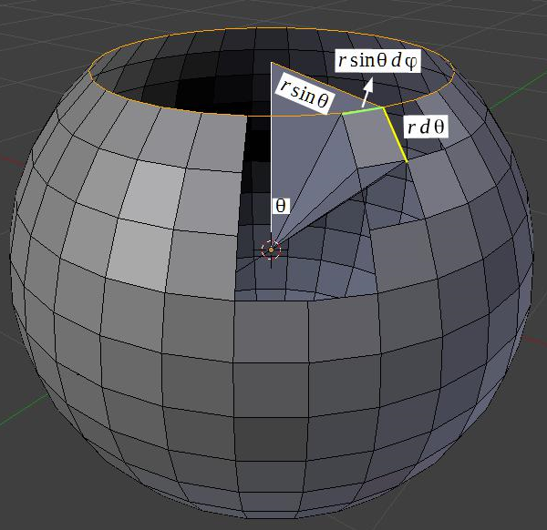
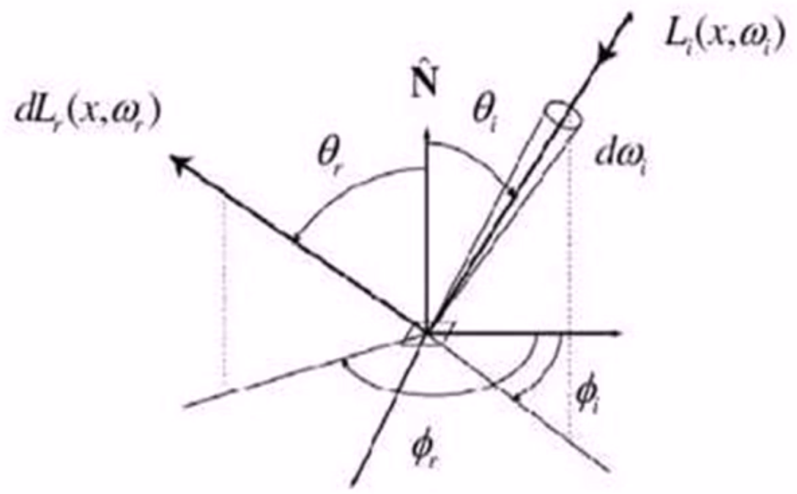

# 双向反射分布函数（BRDF： Bidirectional Reflectance Distribution Function）

描述物体表面对光的反射性质

## 预备知识

### 光照和照明

光照可以分为全局和局部两种

- 局部光照（local illumination）—— 和物体直接被光源照射的情况相关
- 全局光照（global illumination）—— 和物体被光源以外的其他地方来的光线照射的情况相关，包括其他物体反射和透射过来的光线

### 球面坐标(Spherical Coordinate)

由于光线主要是通过方向来表达，通常用球面坐标表达他们比用笛卡尔坐标更方便。
如图所示，球面坐标中的向量用三个元素来指定：

- $r$ 表示向量的长度
- $\theta$ 表示向量和 $z$ 轴的夹角
- $\phi$ 表示向量在 $x-y$ 平面上的投影和$x$轴的逆时针夹角。

[球面坐标](./球面坐标.drawio ':include :type=code')

球面坐标与三维笛卡尔坐标之间对应关系：$Car(x,y,z)=Sph(r, theta, phi)$
它们的转换公式为：

$$
\begin{aligned}
\text(Sph \rightarrow Car) \\
r &= \sqrt{x^2+y^2+z^2}\\
\theta &= acos(z/r)\\
\phi &= atan(y/x)\\
\text(Car \rightarrow Sph) \\
z &= r \cos(\theta)\\
y &= r\sin(\theta)\sin(\phi)\\
x &=r\sin(\theta)\cos(\phi)
\end{aligned}
$$

### 立体角（Solid Angle）

立体角描述了从原点想一个球面区域扩张成的视野大小，是平面角在三维的自然推广。
立体角的最大值为全角： $\mathrm{4}\pi$, 该最大值可以在区域为整个球面时取到。

立体角 $\omega$ 具有如下微分形式：

$$
\mathrm{d}\omega=\frac{\mathrm{d}A}{r^2}
$$

由于面积微元在球面坐标系下可以写成：

$$
\mathtt{d}A=(r\mathtt{d}\theta)(r\sin\theta\mathtt{d}\varphi)=r^2\sin\theta\mathtt{d}\theta\mathtt{d}\varphi
$$

因此：

$$
\mathtt{d}\omega=\frac{\mathtt{d}A}{r^2}=\sin\theta\mathtt{d}\theta\mathtt{d}\varphi
$$

可以参考维基百科：[立体角](https://zh.wikipedia.org/wiki/%E7%AB%8B%E9%AB%94%E8%A7%92)

### 投影面积(Foreshortened Area)

投影面积描述了一个物体表面的微小区域在某视线方向上的可见面积。

对于面积微元 $\mathbf{A}$,则沿着与法相夹角为 $\theta$ 方向的 $\mathbf{A}$ 的可见面积为：$Area = A\cos\theta$

[投影面积](./投影面积.drawio ':include :type=code')

### 光能(Radiant Energy)

光能表示的是一个区域中光子能量的总和。光能通常使用符号 $\mathbf{Q}$ 来表示，其单位是**焦耳($J$)**, 光能不会停留，或者存储在某个位置不懂，它始终在不断地运动着。

### 光通量(Radiant Flux)

光通量描述的是在单位时间穿过单位面积界面的光能：

$$
\Phi = \frac{\mathrm{d}\mathit{Q}}{\mathrm{d}t}
$$

通常使用符号$\Phi$来表示，单位是 **瓦特($W$)** 

### 辉度(Irradiance)

表示物体受光能的影响程度，它等于单位面积上的光通量：

$$
\mathbf{E} = \frac{\mathrm{d}\Phi}{\mathrm{d}A}
$$

通常使用符号$\mathbf{E}$来表示，单位是 $\mathbf{W/m^2}$

### 发光强度(Intensity)

对一个点（例如点光源）来说，发光强度表示单位立体角上的光通量：

$$
\mathit{I} = \frac{d\Phi}{d\omega}
$$

发光强度简称光强，使用符号$\mathbf{I}$来表示，单位是$\mathbf{W}$

### 光亮度(Radiance)

表示物体表面沿某一方向的明亮程度，它等于单位投影面积和单位立体角上的光通量，使用符号$\mathbf{L}$来表示，单位是$\mathbf{W/m^2}$

理解方法：将光亮度理解为物体表面的微面元所接收的来自于某方向光源的单位面积的光通量，因此截面选用垂直于该方向的截面，其面积按投影面积计算。

光亮度的微分形式：

$$
\mathit{L}=\frac{\mathrm{d}^2\Phi}{\mathrm{d}A\cos\theta \mathrm{d} \omega}
$$

光亮度使用物体表面沿目标方向上的投影面积，而不是面积。

### 辉度与光亮度的关系

辉度可以协程光亮度在入射光所形成的半球上的积分：

$$
\frac{\mathrm{d}\Phi}{\mathrm{d}A} = \mathit{E}=\int_{\omega}L(\omega)\cos\theta\mathrm{d}\omega
$$

其中，$\Omega$ 是入射光所形成的半球。$\mathbf{L(\omega)}$沿$\omega$方向的光亮度。

维基百科：[辐射率](https://zh.wikipedia.org/wiki/%E8%BE%90%E5%B0%84%E7%8E%87)

## BRDF 的定义与性质

### BRDF的定义

BRDF 描述的是物体表面将光能从任何一个入射方向反射到任何一个视点方向的反射特性。BRDF 模型是绝大多数近代图形学算法中用于描述光反射现象的基本模型。

BRDF是关于入射光方向和反射光方向的四维实值函数，它等于反射方向的光亮度和沿入射方向的入射光的辉度之比：
$$
\mathit{f}(\omega_i \to \omega_r)=\frac{\mathrm{d}\mathit{L}_r(\omega_r)}{\mathrm{d}\mathit{E}_i}
$$

可以写成关于入射光的光亮度的形式：$$\mathit{f}(\omega_i \to \omega_r)=\frac{\mathrm{d}\mathit{L}_r(\omega_r)}{\mathit{L}_i(\omega_i)\cos\omega_id\omega_i}$$

### BRDF的性质

#### 1. 可逆性（Reciprocity）

BRDF 的可逆性源自于 Helmholtz 光路可逆性(Helmholtz Reciprocity Rule).
BRDF 的可逆性是说： 交换入射光与反射光的角色，并不会改变BRDF的值：
$$
\mathit{\large f}(\omega_i \to \omega_r) = \mathit{\large }(\omega_r \to \omega_i)
$$

#### 2. 能量守恒

BRDF 需要遵循的另一个物理定律是能量守恒定律。能量守恒定律指出： 入射光的能量与出射光的总能量应该相等。

能量守恒方程如下：

$$
\mathit{Q}_{incoming}=\mathit{Q}_{reflected} + \mathit{Q}_{absorb} + \mathit{Q}_{transmitted}
$$

由此可得：
$$
\mathit{Q}_{reflected} \le \mathit{Q}_{incoming}
$$

因此 BRDF 必须满足如下的积分不等式，也就是所谓的能量守恒性质：

$$
\int_\Omega\mathit{\large f}(\omega_i \to \omega_r)\cos\omega_r\mathit{d}\omega_r \le 1
$$

#### 3. 基于BRDF的渲染方程（Rendering Equation）

用于计算环境光照明下的反射光的光亮度，它可以协程不同角度下入射光的光亮度乘以 BRDF 的积分：

$$
\mathit{L}_r=\int_\Omega\mathit{\large f}(\omega_i \to \omega_r)\mathit{L}(\omega_i)\cos\omega_i\mathrm{d}\omega_i
$$

## BRDF 模型

为了方便和高效地使用 BRDF 数据， 它们往往被组织成为参数化的数值模型。
BRDF的数值模型具有如下三类：

- 经验模型(Empirical Models)
  - 使用基于实验提出的公式对 BRDF 做快速估计。
- 基于物理的模型(Physical-based Models)
  - 根据物体表面材料的几何以及光学属性建立反射方程，从而计算 BRDF。
- 数据表达的模型(Data-driven Models)
  - 将 BRDF 按照实测数据建立查找表，以便于快速地查找和计算。

### 经验模型

- 经验模型提供简洁的公式以便于反射光线的快速计算。
- 经验模型不考虑材质特性，仅仅提供一个反射光的粗糙近似
- 经验模型不一定满足物理定律，如Helmholtz可逆性或能量守恒定律等。
- 经验模型因为其简洁和高效性被广泛使用

#### Lambertain 模型

最基本的反射模型：

- 入射光线被均匀地反射到各个方向
- 沿不同方向的BRDF是一个常数

##### 反射率(Albedo): $\rho$

反射率是反射光亮度与入射光亮度之比。

$$
\begin{aligned}
\mathit{L}_r(\omega_r)&=\int_\Omega\mathit{\large f}L_i(\omega_i)\cos\omega_id\omega_i \\
&= \mathit{\large f}\int_\Omega L_i(\omega_i)\cos\omega_i d\omega_i
\end{aligned} = \mathit{fE}_i \\

\rho = \frac{E_r}{E_i}=\frac{\int_\Omega L_r(\omega_r)\cos\omega_r d\omega_r}{\int_\Omega L_i(\omega_i)\cos\omega_i d\omega_i}
 = \frac{\mathit{\large f E_i}\pi}{\mathit{E}_i} = \pi \mathit{\large f}
$$

## BRDF 的度量与评价
