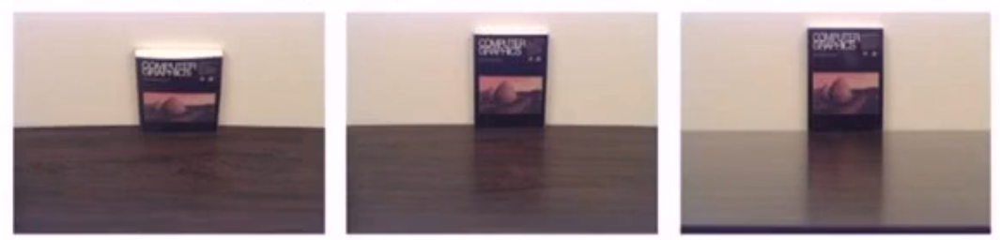
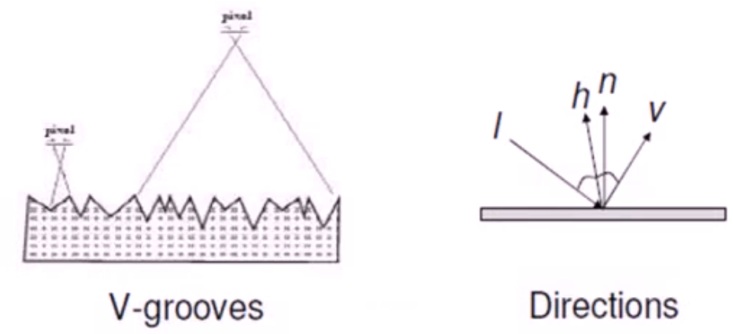
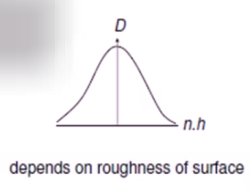
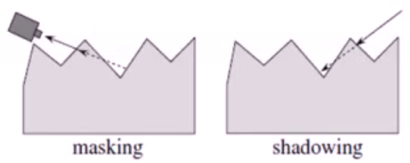
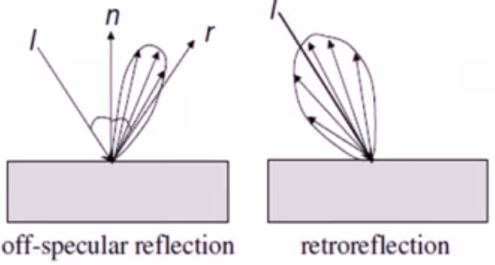

# 双向反射分布函数（BRDF： Bidirectional Reflectance Distribution Function）

描述物体表面对光的反射性质

## 预备知识

### 光照和照明

光照可以分为全局和局部两种

- 局部光照（local illumination）—— 和物体直接被光源照射的情况相关
- 全局光照（global illumination）—— 和物体被光源以外的其他地方来的光线照射的情况相关，包括其他物体反射和透射过来的光线

### 球面坐标(Spherical Coordinate)

由于光线主要是通过方向来表达，通常用球面坐标表达他们比用笛卡尔坐标更方便。
如图所示，球面坐标中的向量用三个元素来指定：

- $r$ 表示向量的长度
- $\theta$ 表示向量和 $z$ 轴的夹角
- $\phi$ 表示向量在 $x-y$ 平面上的投影和$x$轴的逆时针夹角。

[球面坐标](./球面坐标.drawio ':include :type=code')

球面坐标与三维笛卡尔坐标之间对应关系：$Car(x,y,z)=Sph(r, theta, phi)$
它们的转换公式为：

$$
\begin{aligned}
\text(Sph \rightarrow Car) \\
r &= \sqrt{x^2+y^2+z^2}\\
\theta &= acos(z/r)\\
\phi &= atan(y/x)\\
\text(Car \rightarrow Sph) \\
z &= r \cos(\theta)\\
y &= r\sin(\theta)\sin(\phi)\\
x &=r\sin(\theta)\cos(\phi)
\end{aligned}
$$

### 立体角（Solid Angle）

立体角描述了从原点想一个球面区域扩张成的视野大小，是平面角在三维的自然推广。
立体角的最大值为全角： $\mathrm{4}\pi$, 该最大值可以在区域为整个球面时取到。

立体角 $\omega$ 具有如下微分形式：

$$
\mathrm{d}\omega=\frac{\mathrm{d}A}{r^2}
$$

由于面积微元在球面坐标系下可以写成：

$$
\mathtt{d}A=(r\mathtt{d}\theta)(r\sin\theta\mathtt{d}\varphi)=r^2\sin\theta\mathtt{d}\theta\mathtt{d}\varphi
$$

因此：

$$
\mathtt{d}\omega=\frac{\mathtt{d}A}{r^2}=\sin\theta\mathtt{d}\theta\mathtt{d}\varphi
$$

可以参考维基百科：[立体角](https://zh.wikipedia.org/wiki/%E7%AB%8B%E9%AB%94%E8%A7%92)

### 投影面积(Foreshortened Area)

投影面积描述了一个物体表面的微小区域在某视线方向上的可见面积。

对于面积微元 $\mathbf{A}$,则沿着与法相夹角为 $\theta$ 方向的 $\mathbf{A}$ 的可见面积为：$Area = A\cos\theta$

[投影面积](./投影面积.drawio ':include :type=code')

### 光能(Radiant Energy)

光能表示的是一个区域中光子能量的总和。光能通常使用符号 $\mathbf{Q}$ 来表示，其单位是**焦耳($J$)**, 光能不会停留，或者存储在某个位置不懂，它始终在不断地运动着。

### 光通量(Radiant Flux)

光通量描述的是在单位时间穿过单位面积界面的光能：

$$
\Phi = \frac{\mathrm{d}\mathit{Q}}{\mathrm{d}t}
$$

通常使用符号$\Phi$来表示，单位是 **瓦特($W$)** 

### 辉度(Irradiance)

表示物体受光能的影响程度，它等于单位面积上的光通量：

$$
\mathbf{E} = \frac{\mathrm{d}\Phi}{\mathrm{d}A}
$$

通常使用符号$\mathbf{E}$来表示，单位是 $\mathbf{W/m^2}$

### 发光强度(Intensity)

对一个点（例如点光源）来说，发光强度表示单位立体角上的光通量：

$$
\mathit{I} = \frac{d\Phi}{d\omega}
$$

发光强度简称光强，使用符号$\mathbf{I}$来表示，单位是$\mathbf{W}$

### 光亮度(Radiance)

表示物体表面沿某一方向的明亮程度，它等于单位投影面积和单位立体角上的光通量，使用符号$\mathbf{L}$来表示，单位是$\mathbf{W/m^2}$

理解方法：将光亮度理解为物体表面的微面元所接收的来自于某方向光源的单位面积的光通量，因此截面选用垂直于该方向的截面，其面积按投影面积计算。

光亮度的微分形式：

$$
\mathit{L}=\frac{\mathrm{d}^2\Phi}{\mathrm{d}A\cos\theta \mathrm{d} \omega}
$$

光亮度使用物体表面沿目标方向上的投影面积，而不是面积。

### 辉度与光亮度的关系

辉度可以写成光亮度在入射光所形成的半球上的积分：

$$
\frac{\mathrm{d}\Phi}{\mathrm{d}A} = \mathit{E}=\int_{\omega}L(\omega)\cos\theta\mathrm{d}\omega
$$

其中，$\Omega$ 是入射光所形成的半球。$\mathbf{L(\omega)}$沿$\omega$方向的光亮度。

维基百科：[辐射率](https://zh.wikipedia.org/wiki/%E8%BE%90%E5%B0%84%E7%8E%87)

## BRDF 的定义与性质

### BRDF的定义

BRDF 描述的是物体表面将光能从任何一个入射方向反射到任何一个视点方向的反射特性。BRDF 模型是绝大多数近代图形学算法中用于描述光反射现象的基本模型。

BRDF是关于入射光方向和反射光方向的四维实值函数，它等于反射方向的光亮度和沿入射方向的入射光的辉度之比：
$$
\mathit{f}(\omega_i \to \omega_r)=\frac{\mathrm{d}\mathit{L}_r(\omega_r)}{\mathrm{d}\mathit{E}_i}
$$

可以写成关于入射光的光亮度的形式：$$\mathit{f}(\omega_i \to \omega_r)=\frac{\mathrm{d}\mathit{L}_r(\omega_r)}{\mathit{L}_i(\omega_i)\cos\omega_id\omega_i}$$

### BRDF的性质

#### 1. 可逆性（Reciprocity）

BRDF 的可逆性源自于 Helmholtz 光路可逆性(Helmholtz Reciprocity Rule).
BRDF 的可逆性是说： 交换入射光与反射光的角色，并不会改变BRDF的值：
$$
\mathit{\large f}(\omega_i \to \omega_r) = \mathit{\large }(\omega_r \to \omega_i)
$$

#### 2. 能量守恒

BRDF 需要遵循的另一个物理定律是能量守恒定律。能量守恒定律指出： 入射光的能量与出射光的总能量应该相等。

能量守恒方程如下：

$$
\mathit{Q}_{incoming}=\mathit{Q}_{reflected} + \mathit{Q}_{absorb} + \mathit{Q}_{transmitted}
$$

由此可得：
$$
\mathit{Q}_{reflected} \le \mathit{Q}_{incoming}
$$

因此 BRDF 必须满足如下的积分不等式，也就是所谓的能量守恒性质：

$$
\int_\Omega\mathit{\large f}(\omega_i \to \omega_r)\cos\omega_r\mathit{d}\omega_r \le 1
$$

#### 3. 基于BRDF的渲染方程（Rendering Equation）

用于计算环境光照明下的反射光的光亮度，它可以写成不同角度下入射光的光亮度乘以 BRDF 的积分：

$$
\mathit{L}_r=\int_\Omega\mathit{\large f}(\omega_i \to \omega_r)\mathit{L}(\omega_i)\cos\omega_i\mathrm{d}\omega_i
$$

## BRDF 模型

为了方便和高效地使用 BRDF 数据， 它们往往被组织成为参数化的数值模型。
BRDF的数值模型具有如下三类：

- 经验模型(Empirical Models)
  - 使用基于实验提出的公式对 BRDF 做快速估计。
- 基于物理的模型(Physical-based Models)
  - 根据物体表面材料的几何以及光学属性建立反射方程，从而计算 BRDF。
- 数据表达的模型(Data-driven Models)
  - 将 BRDF 按照实测数据建立查找表，以便于快速地查找和计算。

### 经验模型

- 经验模型提供简洁的公式以便于反射光线的快速计算。
- 经验模型不考虑材质特性，仅仅提供一个反射光的粗糙近似
- 经验模型不一定满足物理定律，如Helmholtz可逆性或能量守恒定律等。
- 经验模型因为其简洁和高效性被广泛使用

#### Lambertain 模型

最基本的反射模型：

- 入射光线被均匀地反射到各个方向
- 沿不同方向的BRDF是一个常数

##### 反射率(Albedo): $\rho$

反射率是反射光辉度与入射光辉度之比。

$$
\begin{aligned}
\mathit{L}_r(\omega_r)&=\int_\Omega\mathit{f}L_i(\omega_i)\cos\omega_id\omega_i \\
&= \mathit{f}\int_\Omega L_i(\omega_i)\cos\omega_i d\omega_i = \mathit{fE}_i
\end{aligned} \\

\rho = \frac{E_r}{E_i}=\frac{\int_\Omega L_r(\omega_r)\cos\omega_r d\omega_r}{\int_\Omega L_i(\omega_i)\cos\omega_i d\omega_i}
 = \frac{\mathit{f E_i}\pi}{\mathit{E}_i} = \pi \mathit{f}
$$

其中 f 是常数

#### Lambert 漫反射模型

Lambert 漫反射模型能够很好地用于描述那些包含纯粹漫反射的物体（例如：纸张）；

Lambert 漫反射模型不能表现出材质的镜面反射效果，而镜面反射对于金属材质非常重要；

由于 Lambert 模型的简洁以及对漫反射良好的描述特性，它常常在其他的经验模型（例如 Phong 模型）中作为分量的形式被包含。

#### Phong 模型

Phong 模型是在 Lambert 漫反射模型的基础上， 添加了一项镜面反射项，以表达在反射角上的镜面反射效果：

$$
\mathit{f}(\mathit{l \to v}) = \mathit{\rho_d + \rho_s\frac{(r \cdot v)^s}{(n \cdot l)}}
$$

其中：$\mathit{\rho_d}$ 和 $\mathit{\rho_s}$ 分别表示漫反射光和镜面反射光的反射率， $\mathit{s}$ 表示高光指数，用于描述镜面反射的锐利度。

Phong 模型不满足可逆性：

$$
\mathit{f(l \to v)} \ne \mathit{f(v \to l)}
$$

尽管 Phong 模型 缺乏物理解释，并且对于某些金属材质，它并不十分准确；但 Phong 模型仍是目前计算机图形学中被最为广泛使用的基于经验的反射模型。

Phong 模型的优势在于它的简洁和高效性，以及能够同时表现漫反射和镜面反射的特征。

##### Phong 模型的扩展（为了实现进一步加速）

- Blinn-Phong 模型

  通过引入入射方向和$\mathit{l}$和视线方向$\mathit{v}$的角平分线$\mathit{h}$,使用$\mathit{h}$和法向$\mathit{n}$的点积替代原先 Phong 模型中 $\mathit{r}$ 与 $\mathit{v}$ 的点积，可以简化运算：
  $$
  \mathit{f(l \to v)} = \rho_d + \rho_s\frac{(n \cdot h)^s}{(n \cdot l)} where\text{ }\mathit{h=(v + l) / 2}
  $$

- 快速 Phong 绘制（Fast Phong Shading）
  
  由 Bishop 和 Weimer 发表在 1986 年的 ACM SIGGRAPH 年会上
  思想是使用制表和插值的方法对指数项$\mathit{(r \cdot v)^s}$ 进行快速计算，从而视线绘制的加速

- 可逆的 Phong 模型（Modified Phong Model）

  通过去掉 Phong 模型中镜面反射分量的分母项，从而使得修改后的 Phong 模型能够满足可逆性：
  $$
  \begin{aligned}
    \mathit{f(l \to v)} &= \mathit{\rho_d + \rho_s(r \cdot v)^s} \\
    \mathit{f(l \to v)} &= \mathit{f(v \to l)}
  \end{aligned}
  $$

### 物理模型(Physical-Based Models)

经验模型（empirical models） 源于设计者的直觉和实践经验，而物理模型则建立在有关光的相互作用的科学知识上。

通过包含材料的各种几何及光学性质来尽可能精确的近似显示世界中的材料。

物理模型通常建立在被称为表面粗糙度（surface roughness） 的细节几何结构上。

#### 粗糙度

从微观角度来看，几乎没有完全光滑的表面，微观尺度的表面几何是通过一组微平面（microfacets）几何来建模的，粗糙度通过为平面法向的统计分布来表达的。

#### 菲涅尔项（Fresnel Term）

在实际应用中，我们发现，单向反射性在擦地角(grazing angles)附近增大

百科地址：[Angle_of_incidence](https://en.wikipedia.org/wiki/Angle_of_incidence_(optics))

入射光的反射两是由麦克斯韦电磁波方程组中得到的菲涅尔公式得到的。

[菲涅尔反射几何](./菲涅尔反射几何.drawio ':include :type=code')

定义如下：

$$
\begin{aligned}
  F_s &= \frac{a^2 + b^2-2a\cos\theta + \cos^2\theta}{a^2 + b^2 + 2a\cos\theta + \cos^2\theta} \\
  F_p &= F_s\frac{a^2+b^2-2a\sin\theta\tan\theta+\sin^2\theta\tan^2\theta}{a^2+b^2 + 2a\sin\theta\tan\theta+\sin^2\theta\tan^2\theta}
\end{aligned} \\

\begin{aligned}
  2a^2 &= \sqrt{(\eta^2 - \kappa^2 - \sin^2\theta)^2+4\eta^2\kappa^2}+(\eta^2 - \kappa^2 - \sin^2\theta) \\
  2b^2 &= \sqrt{(\eta^2 - \kappa^2 - \sin^2\theta)^2+4\eta^2\kappa^2}-(\eta^2 - \kappa^2 - \sin^2\theta) \\
\end{aligned} \\

\begin{aligned}
  \eta &= \frac{\eta_m\eta_a + \kappa_m\kappa_a}{\eta_a^2 + \kappa_a^2} \\
  \kappa &= \frac{\eta_a\kappa_m - \eta_m\kappa_a}{\eta_a^2 + \kappa_a^2}
\end{aligned}

$$

菲涅尔反射率：$F = (F_p + F_s)/2$

#### Cook-Torrance 模型

由 Cook 和 Torrance 提出[A Reflectance Model for Computer Graphics, ACM SIGGRAPH, 1981]， 这是在图形学中最早使用的BRDF物理模型， 是应用物理学家开发的 Torrance-Sparrow 模型的一个应用版本。[Theory for Off-Specular Reflection from Roughened Surfaces, J. Optical Society of America, 1975]

Cook-Torramce 模型假设微平面是镜面反射的，微平面被假定按如图所示V形沟槽排列。

结合 Lambertain 漫反射项与微平面反射的镜面反射项：

$$
\mathit{f_\lambda} = \mathit{d\frac{\large \rho_d}{\pi} + s\mathit{\large F}_\lambda\frac{DG}{4\pi(n \cdot l)(n \cdot v)}}
$$

这里的 $F_\lambda$ 是菲涅尔因子，$D$ 是 微平面法向的分布函数，$G$ 是几何衰减因子，$s,d$ 是镜面反射和漫反射系数。

##### 微平面法向的分布函数$D$

由于微平面只有镜面反射，只有那些法向沿着平分线方向$h$的才对镜面反射起作用。

采用 Bechmann 分布来描述：

$$
\mathit{
  D(h)=\frac{1}{m^2\cos^4\beta}e^{-\frac{\tan^2\beta}{m^2}}
}
$$

其中，$m$ 是表面的粗糙度值，$\beta$ 是 $n$ 和 $h$ 的夹角。

##### 几何衰减系数$G$(Geometric Attenuation Factor)

考虑来自视角方向的遮挡效果和来自光线方向的阴影效果，用于排除被遮挡的(masked) 和阴影覆盖的（shadowing） 微平面， G定义如下：

$$
\mathit{
  G(n,l,v) = min\begin{Bmatrix}
    1,\frac{2(n \cdot h)(n \cdot v)}{(v \cdot h)},\frac{2(n \cdot h)(n \cdot l)}{(v \cdot h)}
  \end{Bmatrix}
}
$$

这种对微平面遮挡和阴影的考虑使得可以产生某些反射特性，一个是反射方向不在镜面方向的反射（off-specular reflection），一个是逆反射(restroreflection)

#### 其它物理模型

BRDF可以分为两类：

- 各向同性（Isotropic）
  - 反射不受与给定表面法向夹角的约束
  - 随机表面微结构
- 各向异性（Anisotropic）
  - 反射比随着与某个给定的表面法向之间的夹角而变化
  - 图案的表面微结构不是均匀的，而是随机的
  - 金属丝、绸缎、毛发

#### Ward 模型

由 Ward 于 1992 年提出[Measuring and Modeling Anisotropic Reflection, ACM SIGGRAPH, 1992]

介绍了一种更一般的表面法向表达方式：通过椭圆体(ellipsoids)这种允许各向异性反射的形式来表达

然而由于没有考虑菲涅尔因子(Fresnel factor)和几何衰减因子(geometric attenuation factor), 该模型更像是一种经验模型。

各向同性的 Ward 模型定义为：

$$
\mathit{
  \rho_{bd\text{ }iso}(\theta_i\phi_i,\theta_r,\phi_r)=\frac{\rho_d}{\pi}+\rho_s \cdot \frac{1}{\sqrt{\cos\theta_i\cos\theta_r}} \cdot \frac{exp[-\tan^2\delta/\alpha^2]}{4\pi a^2}
}
$$

其中：

- $\rho_d$是漫反射系数
- $\rho_s$是镜面反射系数
- $\delta$ 是 $\^{n}$ 和 $\^{h}$的夹角
- $\alpha$ 是表面坡度的标准差

将菲涅尔因子和几何衰减因子替换为一个用于保证分布在整个半球内积分的简单归一化项

各向异性的Ward模型定义为：
$$
\mathit{
  \rho_bd(\theta_i,\phi_i,\theta_r,\phi_r)=\frac{\rho_d}{\pi}+\rho_s \cdot \frac{1}{\sqrt{\cos\theta_i\cos\theta_r}} \cdot \frac{exp[-\tan^2\delta(\cos^2\phi/\alpha_x^2 + \sin^2\phi/\alpha_y^2)]}{4\pi\alpha_x\alpha_y}
}
$$

其中：

- $\rho_d$ 是漫反射系数
- $\rho_s$ 是镜面反射系数
- $\delta$ 是 $\^{n}$ 和 $\^{h}$ 的夹角
- $\alpha_x$ 是 $\^{x}$ 方向表现坡度的标准差
- $\alpha_y$ 是 $\^{y}$ 方向表现坡度的标准差
- $\phi$ 是 $\^{h}$ 投影到表面的方位角

### 更多的 BRDF 模型

- Oren-Nayar 模型 [Generalization of Lambert's Reflectance Model ACM SIGGRAPH, 1994]
  - 将微平面当做 Lambertian 反射体二不是镜子
- Poulin-Fournier 模型 [A Model for Anisortopic Reflection, ACM SIGGRAPH, 1990]
  - 将微平面的法向表示为一组平行的圆柱体，同样处理各向异性的情况。

### 更多 BRDF 类模型

波动光学（Wave Optic） 相关模型：

- 由波动光学原理发展而来
- 材料的微平面大小和光的波长相当
- 基于不同的衍射（diffraction） 理论，由两个工作 [He, et al., A Comprehensive Physical Model for Light Reflection, ACM SIGGRAPH, 1991] and [Stam, Diffraction Shaders, ACM SIGGRAPH, 1999]
- 虽然有很强的描述能力，但由于模型本身过于复杂而限制了它们的应用

### 数据驱动的BRDF模型

度量一个大的材料集合的 BRDF， 并将其记录为高维向量

利用降维方法从这些数据中计算一个低维流型

代表工作：Matusik et al. [A Data-Driven Reflectance Model, ACM SIGGRAPH, 2003]

#### BRDF 表达形式的对比

- 经验模型（Empirical Models）
  计算简单，可以产生视觉上可接受的结果
- 物理模型（Physical-Based Models）
  参数具有物理意义、基于科学知识构建
- 数据驱动模型（Data-Driven Models）
  - 灵活，对材料属性没有假设限定
  - 很大的数据集，通常需要数据降维方法来压缩数据
  - Needs Interpolating data, missing high light parts

## BRDF 的度量与评价

### 动机

- 为了对具有未知反射属性的材料进行建模，并生成具有高度真实感的结果
- 恢复 BRDF 和其他场景属性的过程时也被称作逆渲染
- BRDF 度量概述
  - 度量设备
  - 实际获取中的问题
