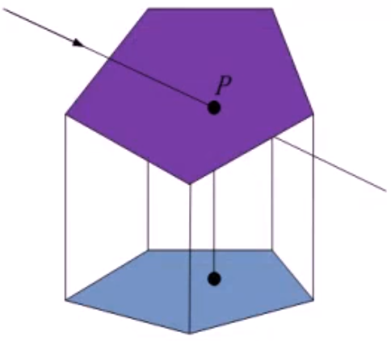
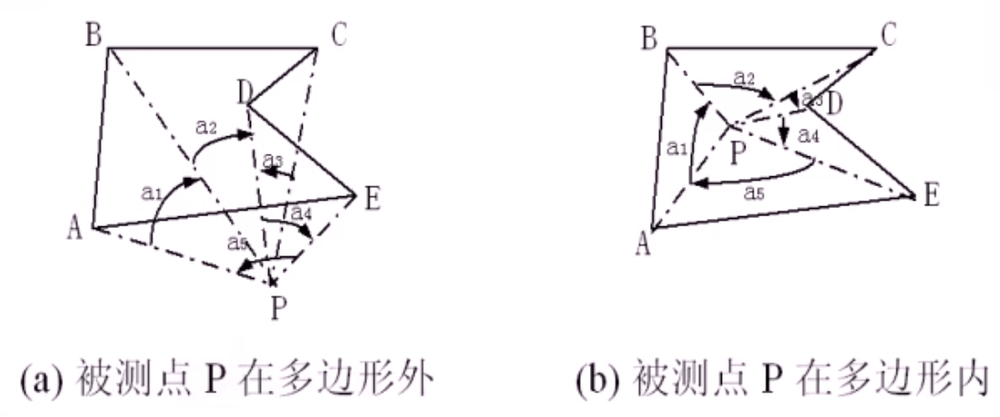
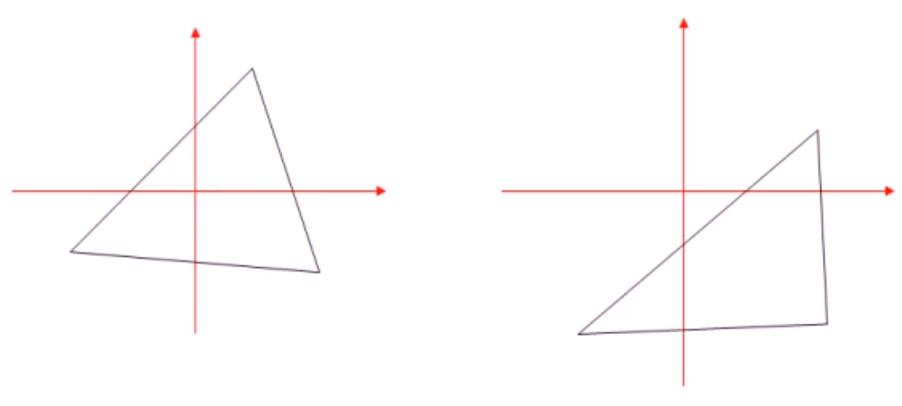
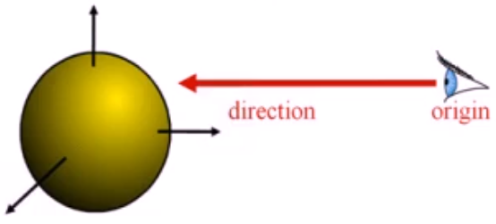
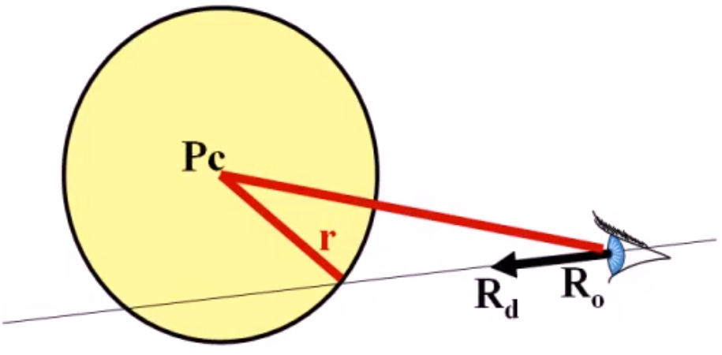
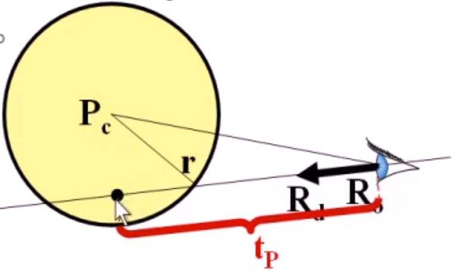
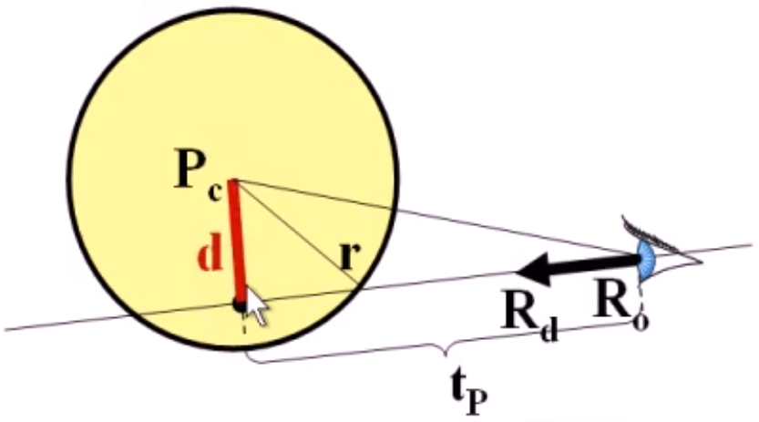
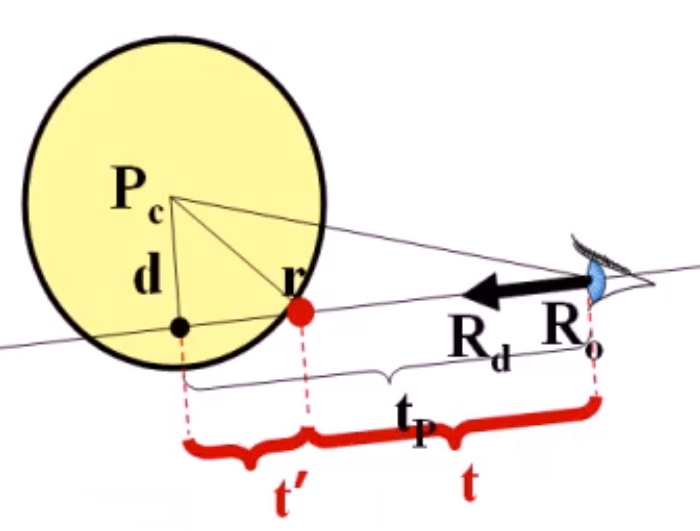

# 光线算法

## 光线跟踪概述

可以实现其它算法来很难达到的效果，它作为一个有效的真实感图形绘制算法被管范地使用。

为什么我们能看见物体：

光(Light) 可以理解为一系列由光源发出、经物体反复弹射而最终进入视点的光线(Rays)，最终将光线射入人们眼中，使我们看到物体。

### 光线跟踪的思路和框架

将显示缓存区看成是由空间中的像素组成的矩形阵列，人眼透过这些像素看到场景中的物体。对于每个像素 P 计算其色彩值：

- 计算由视点连接像素 P 中信的光线延长后所碰到的第一个物体的焦点
- 使用局部关照模型（如 Phong 模型）计算焦点处的颜色值
- 沿焦点处的反射和折射方向对光线进行跟踪

#### 光线跟踪的特征

通过光线跟踪，可以很容易地表现出例如阴影、反射、折射等引人入胜的视觉效果
除了基本的几何形体（例如球体、椎体、立方体等），光线跟踪容易适用于更复杂的物体表示方法（例如多边形网格表示或者复合形体等）。

#### 使用递归实现的光线跟踪算法


```txt
IntersectColor(vBeginPoint, vDirection) {
    Determine IntersectPoint;  // 求第一个焦点
    Color = ambient color; // 环境光初始值
    for each light 
        Color += local shading term; // 加局部Phong模型光照
    if(surface is reflective) // 判断表面是否可反射
        color += reflect Coefficient * IntersectColor(IntersectPoint, Reflect Ray); // 加上反射系数 * .... 
    else if (surface is refractive) 
        color += refract Coefficient * IntersectColor(IntersecPoint, Refract Ray); // 折射系数 * ....
    return color;
}
```

## 光线求交（Ray Intersection）

### 光线的表示

光线（射线）的参数表示：

$$ \bold{\mathit{P(t) = R_0 + t * R_d}}$$

- $\mathit{R_0=(x_0,y_0,z_0)}$ 是光线的源点，向量 $\mathit{R_d=(x_d,y_d,z_d)}$代表光线的朝向，通常来说$R_d$是单位向量。
- 参数$\mathit{t}$是表示光线到达的位置，在光线的正方向上，参数$\mathit{t}$都是正数：$\mathit{t > 0}$


### 光线与平面（Plane）求交

平面的表示：

- 显示表示：
    $$\mathit{P_0=(x_0,y_0,z_0)},n=(A,B,C)$$
- 隐示表示：
  $$
    \begin{aligned}
        H(P)&=Ax+By+Cz+D = 0 \\
        &= n \cdot P + D = 0
    \end{aligned}
  $$

点到平面的举例：


当 $n$ 是单位法向量时，$\mathit{P}$ 到平面 $\mathit{H}$ 的距离就是 $\mathit{H(p)}$

光线与平面求交


给定满足如下的平面方程：
$$\mathit{n \cdot P + D = 0}$$
如何计算一条光线与平面的焦点？ 连列参数方程和平面方程：

$$ \mathit{P(t) = R_0 + t * R_d} \\
\mathit{n \cdot P(t) + D = 0} $$

解得：$t=-(D + n \cdot R_0)/(n \cdot R_d)$, 最后验算 $ \mathit{t > 0} $，如果 t <=0 时，物体是在背后，是看不见的

### 光线与三角形（Triangle）求交

在实时的图形学中，基于三角形的几何表示（三角面片）十分常见：每个三角形可以使用三个顶点的坐标来表示。
计算光线和三角形的交可以有多种方法，但都包含如下两个部分：

1. 首先计算光线和三角形所在的平面的交；
2. 在三角形所在平面内考虑，判断光线与平面的交点是否位于三角形的内部。

#### 重心坐标

三角形$\mathit{P_0P_1P_2}$内的一点$\mathit{P}$可以表示成：$$\mathit{P = \alpha P_0 + \beta P_1 + \gamma P_2}$$
其中，$\mathit{(\alpha,\beta,\gamma)}$ 被称为重心坐标，他们满足：$$ 0 \le \alpha,\beta,\gamma \le 1, \alpha + \beta + \gamma = 1 $$

重心坐标有许多其他应用：纹理映射、法向插值、颜色插值等等。

#### 光线与三角形求交

我们将 $\alpha + \beta + \gamma = 1 $ 写成 $\alpha = 1 - \beta - \gamma$, 有：
$$\mathit{P=(1 - \beta - \gamma)P_0 + \beta P_1 + \gamma P_2}$$
可以将光线与三角形求交描述成如下方程：

$$\mathit{R_0+tR_d=(1-\beta-\gamma)P_0+\beta P_1 + \gamma P_2}$$

即：
$$\mathit{
    \begin{pmatrix}
        R_d & P_0-P_1 & P_0 - P_2
    \end{pmatrix}
    \begin{bmatrix}
        t \\ \beta \\ \gamma
    \end{bmatrix}
    = P_0 - R_0
}$$

这说明，焦点的重心坐标以及其在直线上的 t 参数可以通过解一个线性方程组而得到。

令：$\mathit{E_1=P_0-P_1,E_2=P_0-P_2,S=P_0-R_0}$
根据 Grammer 法则，我们可以写出：
$$\mathit{
    \begin{pmatrix}
        t \\
        \beta \\
        \gamma
    \end{pmatrix} =
    \frac{1}{det(R_d,E_1,E_2)}
    \begin{pmatrix}
        det(S,E_1,E_2)\\
        det(R_d,S,E_2)\\
        det(R_d,E_1,S)\\
    \end{pmatrix}
}$$

最后需要检查 $t > 0$ 且 $0 \le \beta,\gamma \le 1, \beta + \gamma \le 1$ 以保证焦点位于三角形的内部

### 光线与多边形（Polygon）求交

尽管三角形是最为常用的基本渲染单元，但是光线与多边形求交也是经常需要用到的。
一个$n-$多边形可以表示成$n$个顶点的有序列表 $\mathit{\{v_0,v_1,...,v_{n-1}\}}$,且该多边形的$n$条边分别为：$v_0v_1,v_1v_2,...,v_{n-2}v_{n-1},v_{n-1}v_0$。其中 $v_0,v_1,...,v_{n-1}$位于同一平面，该平面可以表示为：
$$\mathit{\pi_p:n_p \cdot x + d_p} = 0$$

光线与多边形求交：

1. 首先计算光线与多边形所在的平面的焦点
2. 如果焦点存在，我们要判断焦点是否位于多边形内部
3. 为了进行这一判断，我们将焦点以及多边形的所有顶点投影到 XY-,YZ-,ZX-平面中的一个（如图所示），方便后续处理
   

#### 焦点检测算法（计算几何）

在二维情况下，判断一个点是否在一个多边形的内部，可以使用焦点检测算法（Crossing Test）.
焦点检测算法基于如下 Jordan 曲线定理：

平面上一个点位于一个多边形的内部，当且仅当由该点出发的任何一条射线都与多边形的边界有奇数个交点，焦点检测算法也叫做就检测算法。

焦点检测算法如图所示：

[焦点检测算法](./焦点检测算法.drawio ':include :type=code')

- 多边形内部的两个黑点分别与多边形边界相交1次
- 多边形外部的两个黑点分别于多边形相交0次和2次

焦点检测算法是所有不进行预处理的方法中最快的。

需要考虑的特殊情况

1. 射线如果刚好和多边形的一条边平行且重合的
2. 焦点刚好落在顶点上

#### 其他检测算法

可以将需要检测的点作为坐标原点，使用$\mathbf{X}$轴正半轴作为检测焦点的射线，然后逐一对多边形的每条边进行判断：

- 如果多边形某条边的两端点的$\mathbf{Y}$轴坐标符号相同，则这条边与$\mathbf{X}$轴正半轴无交点
- 否则，计算这条边与$\mathbf{X}$轴的交点：
  - 如果这个交点位于$\mathbf{X}$轴正半轴上，那么将统计总焦点个数的变量 + 1.
  - 否则，这条边与$\mathbf{X}$轴正半轴无交点

#### 最快的点包含判别算法：弧长法

以被检测点为圆心，作单位圆，计算其在单位圆上的弧长的代数和。

- 代数和为 0: 点在多边形外部
- 代数和为 $2\pi$：点在多边形内部
- 代数和为 $\pi$：点在多边形边上

实际操作方法：

按照顺时针方向，连接被检测点和多边形的每个顶点，被检测点和多边形两个顶点形成一个角度，计算弧度值（根据方向，有正负之分），把这些弧度值相加，如果和等于0，说明被检测点在多边形外，如果和等于 $2\pi$, 说明被检测点在多边形内部， 如果和为$\pi$， 说明被检测点在边上。



这种算法可靠性高，允许误差存在，但是计算量大。

#### 以顶点符号为基础的弧长累加方法

解决上述方法计算量大的问题。

将坐标原点移到被监测点P。各个象限内点的符号分别为 (+,+), (-, +), (-, -), (+, -).
算法规定，若顶点$P_i$的某个坐标为0,则其符号为 +, 若顶点 $P_i$的x, y坐标都为0，则说明这个顶点为被检测点，我们在这之前予以排除，于是弧长变化如下表：

|$(sx_i,sy_i)$|$(sx_{i+1},sy_{i+1})$|弧长变化|象限变化|
|--|--|--|--|
|(+ +)| (+ +) | 0 | $I \to I$|
|(+ +)| (- +) | $\pi/2$ | $I \to II$|
|(+ +)| (- -) | $\pm\pi$ | $I \to III$|
|(+ +)| (+ -) | $-\pi/2$ | $I \to IV$|

[改进-弧长法](./改进的弧长法.drawio ':include :type=code')

值得注意的是，当边的终点$P_i{i+1}$在起点$P_i$的相对象限时，弧长变化可能增加或减少 $\pi$(通过判断坐标原点在边的上方还是下方来决定):



这样通过判断查表来替代三角函数计算，来提高性能。

> 数学描述
> 设 $(x_i,y_i)$和$(x_{i+1},y_{i+1})$分别为边的起点和终点坐标，计算：$$\mathit{f=y_{x+1}x_i-x_{x+1}y_i}$$
> 若 $\mathit{f=0}$,则边穿过坐标原点。若 $\mathit{f > 0}$，则弧长代数和增加$\pi$，若$f<0$，则弧长代数和减少$\pi$

### 光线与球面（Sphere）求交

#### 数学求解

首先给出球面的数学描述：

给定中心点（球心）$\mathit{P_c}$，半径$\mathit{r}$，可以写出球面的隐式方程：
$$\mathit{f(P)=\begin{Vmatrix}
    P - P_c
\end{Vmatrix}}-r = 0$$

而求光线与球面的焦点，相当于要求解如下的方程：
$$\mathit{
    \begin{Vmatrix}
        P(t)-P_c
    \end{Vmatrix} - r = 0
}$$



将上面的方程进行化简：

$$\mathit{
    \begin{aligned}
        \begin{Vmatrix}
            P(t)-P_c
        \end{Vmatrix} - r = 0 \\
        \begin{Vmatrix}
            R_0+tR_d-P_c
        \end{Vmatrix} = r \\
        (R_0+tR_d-P_c)\cdot(R_0+tR_d-P_c)=r^2\\
        t^2(R_d \cdot R_d) + 2t(R_d \cdot (R_0 - P_c)) + (R_0 - P_c)\cdot (R_o-P_c)-r^2=0\\
    \end{aligned}
}$$

由于$\mathit{R_d}$是单位向量：

$$t^2+2t(R_d \cdot (R_0 - P_c)) + (R_0 - P_c) \cdot (R_0 - P_c) - r^2 = 0$$

记为：$t^2+2tb + c = 0$

解得：$t = -b \plusmn \sqrt{b^2-c}$

之前的代数方法存在可能改进和加速的地方，例如我们实际上并不需要计算被挡住的第二个交点。
下面的几何方法则具有如下优点：

- 能快速判断光线与球面是否相交；
- 能快速判断光源是否在球体内部；
- 能快速判断光线的方向是朝向还是远离球面。

#### 球面求交的几何方法

首先，计算由光源指向球心的向量$\ell$:

$\mathit{\vec{\ell}=P_c-R_0}$



判断光源位置：

- 位于球体内部： $\vec{\ell}^2 < r^2$
- 位于球体外部： $\vec{\ell}^2 > r^2$
- 位于球面上： $\vec{\ell}^2 = r^2$
- 当光源位于球面上时，需要小心考虑退化情况

然后，计算球心到光线所在直线的投影点（垂足）：
$$\color{red}{\mathit{t_p = \vec{\ell} \cdot R_d}}$$

如果光源在球体外部并且 $t_p < 0$, 那么光线与球面不相交



然后计算球心到光线所在的直线距离：
$$\color{red}{\mathit{d^2=\vec{\ell}^2 - t_p^2}}$$
如果 $d > r$, 那么光线与球面不相交



然后计算距离$t'$, $t'$ 是投影点到光线与球面的交点的距离：$\color{red}{\mathit{t'^2 = r^2 - d^2}}$
最后求解光线与球面的交点：

- 如果光源在球体外部：
  - $\color{red}{\mathit{t = t_p - t'}}$
- 如果光源在球体内部：
  - $\color{red}{\mathit{t=t_p+t'}}$



### 光线与长方体（Box）求交

## 阴影（Shadows）

## 透明和镜面反射（Transparence and Specular Reflection）

## 纹理（textures）
