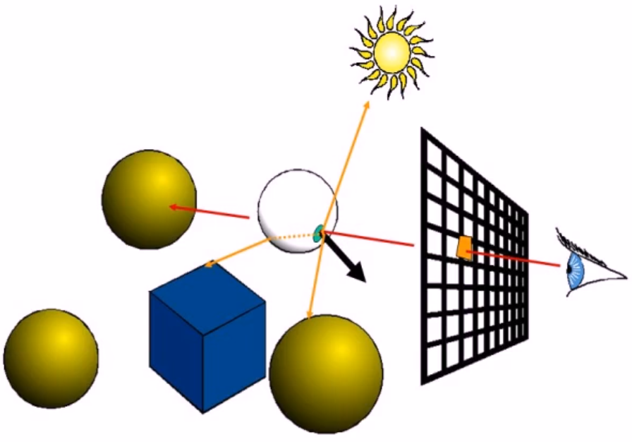
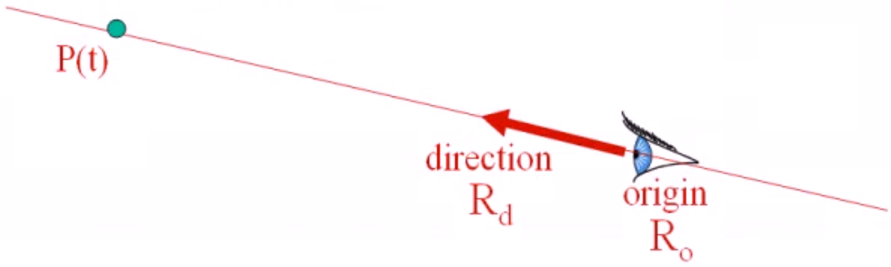
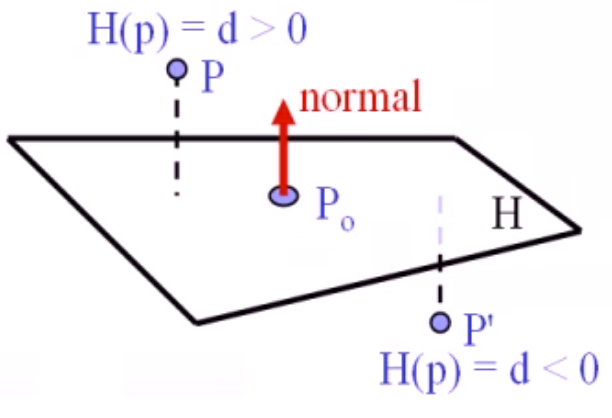
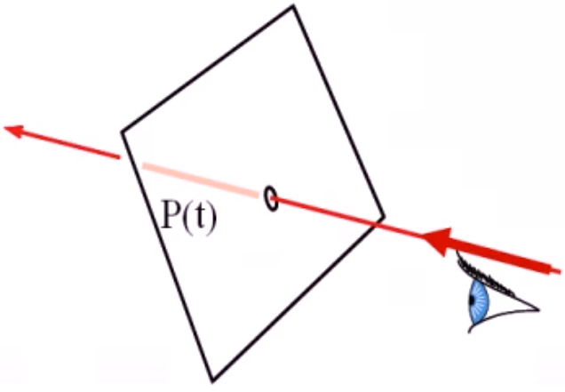

# 光线算法

## 光线跟踪概述

可以实现其它算法来很难达到的效果，它作为一个有效的真实感图形绘制算法被管范地使用。

为什么我们能看见物体：

光(Light) 可以理解为一系列由光源发出、经物体反复弹射而最终进入视点的光线(Rays)，最终将光线射入人们眼中，使我们看到物体。

### 光线跟踪的思路和框架

将显示缓存区看成是由空间中的像素组成的矩形阵列，人眼透过这些像素看到场景中的物体。对于每个像素 P 计算其色彩值：

- 计算由视点连接像素 P 中信的光线延长后所碰到的第一个物体的焦点
- 使用局部关照模型（如 Phong 模型）计算焦点处的颜色值
- 沿焦点处的反射和折射方向对光线进行跟踪

#### 光线跟踪的特征

通过光线跟踪，可以很容易地表现出例如阴影、反射、折射等引人入胜的视觉效果
除了基本的几何形体（例如球体、椎体、立方体等），光线跟踪容易适用于更复杂的物体表示方法（例如多边形网格表示或者复合形体等）。

#### 使用递归实现的光线跟踪算法



```txt
IntersectColor(vBeginPoint, vDirection) {
    Determine IntersectPoint;  // 求第一个焦点
    Color = ambient color; // 环境光初始值
    for each light 
        Color += local shading term; // 加局部Phong模型光照
    if(surface is reflective) // 判断表面是否可反射
        color += reflect Coefficient * IntersectColor(IntersectPoint, Reflect Ray); // 加上反射系数 * .... 
    else if (surface is refractive) 
        color += refract Coefficient * IntersectColor(IntersecPoint, Refract Ray); // 折射系数 * ....
    return color;
}
```

## 光线求交（Ray Intersection）

### 光线的表示

光线（射线）的参数表示：

$$ \bold{\mathit{P(t) = R_0 + t * R_d}}$$

- $\mathit{R_0=(x_0,y_0,z_0)}$ 是光线的源点，向量 $\mathit{R_d=(x_d,y_d,z_d)}$代表光线的朝向，通常来说$R_d$是单位向量。
- 参数$\mathit{t}$是表示光线到达的位置，在光线的正方向上，参数$\mathit{t}$都是正数：$\mathit{t > 0}$



### 光线与平面（Plane）求交

平面的表示：

- 显示表示：
    $$\mathit{P_0=(x_0,y_0,z_0)},n=(A,B,C)$$
- 隐示表示：
  $$
    \begin{aligned}
        H(P)&=Ax+By+Cz+D = 0 \\
        &= n \cdot P + D = 0
    \end{aligned}
  $$

点到平面的举例：



当 $n$ 是单位法向量时，$\mathit{P}$ 到平面 $\mathit{H}$ 的距离就是 $\mathit{H(p)}$

光线与平面求交



给定满足如下的平面方程：
$$\mathit{n \cdot P + D = 0}$$
如何计算一条光线与平面的焦点？ 连列参数方程和平面方程：

$$
\mathit{P(t) = R_0 + t * R_d} \\
\mathit{n \cdot P(t) + D = 0}
$$

解得：$t=-(D + n \cdot R_0)/(n \cdot R_d)$, 最后验算 $ \mathit{t > 0} $，t <=0 时，物体是看不见的

### 光线与三角形（Triangle）求交

### 光线与多边形（Polygon）求交

### 光线与球面（Sphere）求交

### 光线与长方体（Box）求交

## 阴影（Shadows）

## 透明和镜面反射（Transparence and Specular Reflection）

## 纹理（textures）
